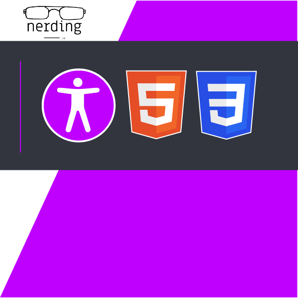

# WCAG Approaching Accessibility Course

Welcome to our [Web content accessibility guidelines course]()! This [course]() to to teach you how to make the web more accessible for others.

## Getting Started

To get started with this project, follow these steps:

1. Clone the repository to your local machine.
2. Install LivePreview
4. Open your web browser and navigate to [http://127.0.0.1:5500](http://127.0.0.1:5500).

## Features

This project includes the following features:

- Feature 1: Level AA Checklist
- Feature 2: Level AAA Checklist

## Usage

To use this project, follow these steps:

1. Open your web browser and navigate to [http://127.0.0.1:5500](http://127.0.0.1:5500).
2. Click on the buttons to activate the features.

## Contributing

If you would like to contribute to this project, please follow these guidelines:

1. Fork the repository to your own account.
2. Make your changes and test them thoroughly.
3. Submit a pull request back to the original repository.

## Credits

This project was created by [Nerding I/O](https://nerding.io).

## License

This project is licensed under the [MIT License](LICENSE).
